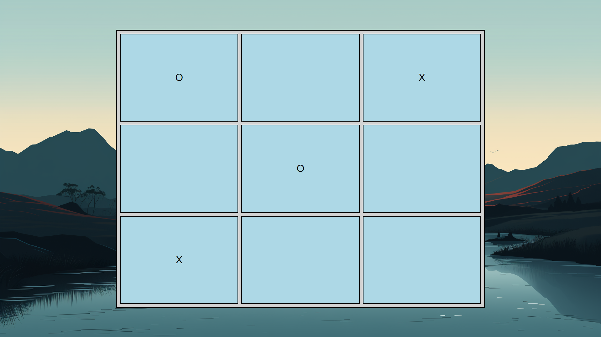

# Noughts and Crosses

This is a simple implementation of the Noughts and Crosses (Tic-Tac-Toe) game using HTML, CSS, and JavaScript.

## Description

The game is played on a 3x3 grid. Players take turns marking a square with their respective symbol (X or O). The first player to get three of their symbols in a row, column, or diagonal wins the game. If all squares are filled and no player has won, the game ends in a draw.

## How to Play

1. Open the `noughts_and_crosses.html` file in a web browser.
2. Click on any empty square to place your symbol (X or O).
3. The game will automatically check for a winner after each move.
4. If a player wins or the game ends in a draw, an alert message will be displayed.

## Preview

